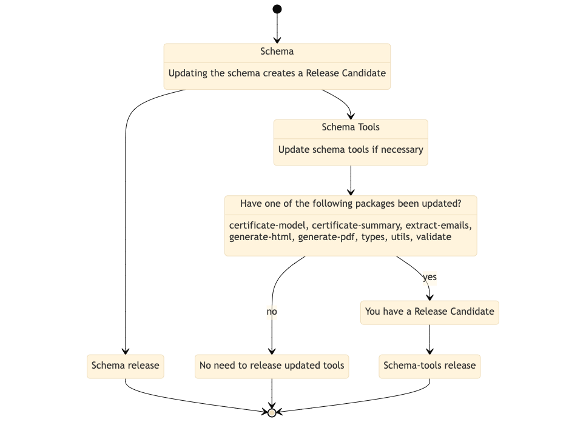

<!-- [[toc]] -->

## Contributing

When updating the schema (links below), the tools need to be updated at the same time.

Schema links:
[EN10168](https://github.com/thematerials-network/EN10168-schemas)
[E-CoC](https://github.com/thematerials-network/E-CoC-schemas)
[CoA](https://github.com/thematerials-network/CoA-schemas)
[CDN](https://github.com/thematerials-network/CDN-schemas)

Process:

1. Update the schema in question
2. Check and update the types using the `create-schema-interfaces` CLI tool in the `schema-tools` repository
3. If necessary, make changes in `generateContent.ts` in `schema-tools/packages/generate-coa-pdf-template/src/generateContent.ts` and run `npm run build`.
   If `generateContent.ts` has been changed and built, copy the contents of `dist/generateContent.js` to the schema repository and replace the contents of `generate-pdf.min.js` in the schema repository with the new minified code
4. For a new Release Candidate, add a new fixture (used for testing). See how to add fixtures [here](https://github.com/s1seven/schema-tools#fixtures)
5. If there have been no changes in `certificate-model, certificate-summary, extract-emails, generate-html, generate-pdf, types, utils, validate` in the `schema-tools` repository, there is no need to update the `schema-tools` release.

